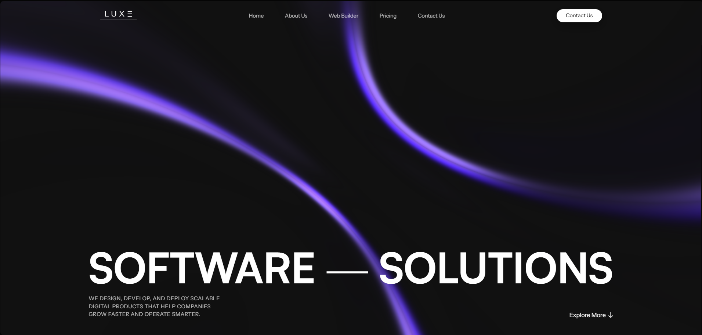

# Luxe Designs Website

Marketing website for Luxe Designs, built with Next.js App Router.


## Overview

- Framework: Next.js 16 + React 19 + TypeScript
- Styling: CSS Modules
- Fonts: `next/font` (optimized, self-hosted loading)
- Analytics: `@vercel/analytics`
- Key pages:
  - `/` Home
  - `/about` About
  - `/pricing` Pricing
  - `/contact` Contact

## Project Structure

- `src/app/` route files, metadata, `sitemap.ts`, and `robots.ts`
- `src/components/layout/` shared layout pieces (`Header`, `Footer`, etc.)
- `src/components/sections/` page section components
- `public/` static assets (images, icons, documents)

## Local Development

```bash
npm install
npm run dev
```

Open `http://localhost:3000`.

## Build & Run

```bash
npm run build
npm run start
```

## SEO & Metadata

- Root metadata is defined in `src/app/layout.tsx` with:
  - `metadataBase`
  - `title.template` for consistent branding
- Page-level metadata is generated via `src/app/seo.ts`
- Each page exports unique metadata (`title`, `description`, `openGraph`, canonical)
- `src/app/sitemap.ts` and `src/app/robots.ts` are included

## Security Headers

Configured in `next.config.ts`, including:

- Content Security Policy (CSP)
- Strict-Transport-Security (HSTS)
- X-Frame-Options
- Cross-Origin-Opener-Policy
- Referrer and permissions policies

## Environment Variables

Create `.env.local` and set:

```bash
NEXT_PUBLIC_SITE_URL=https://your-domain.com
```

This is used for canonical URLs, sitemap host entries, and metadata base URL.

## Notes

- Keep page files (`page.tsx`) server components; move client logic into child components.
- Use `next/image` for all images, with descriptive `alt` text.
- Use accessible labels for icon-only interactive links.